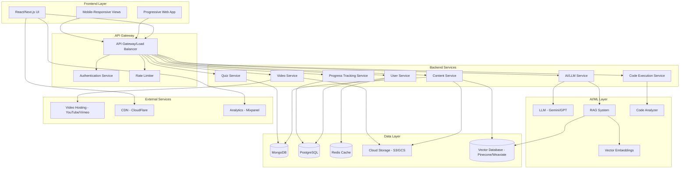
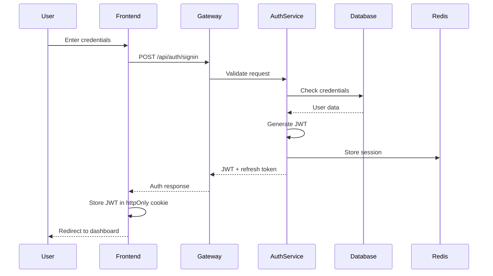
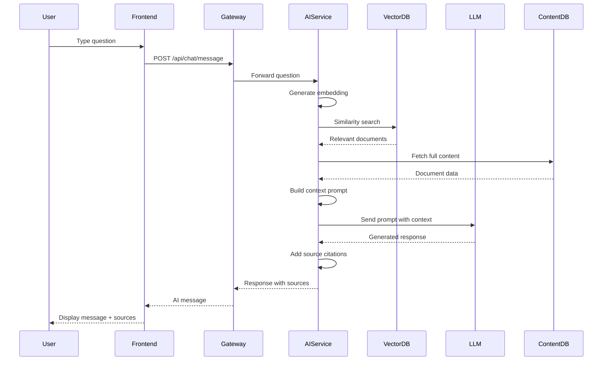
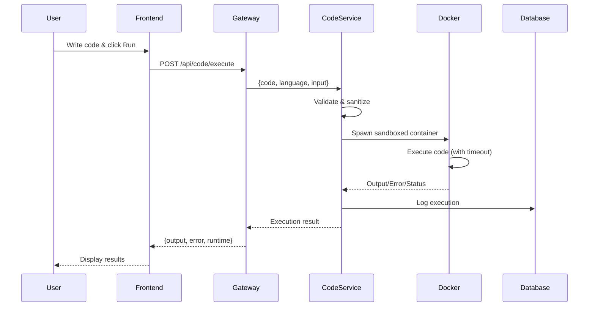
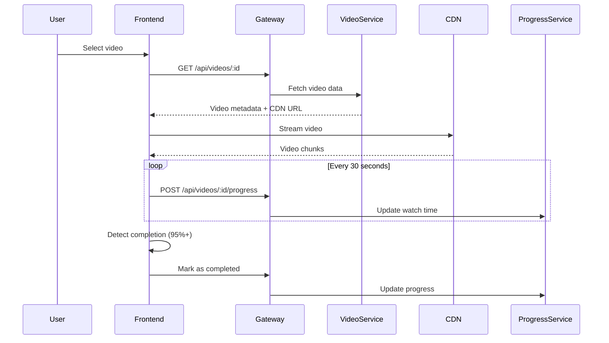
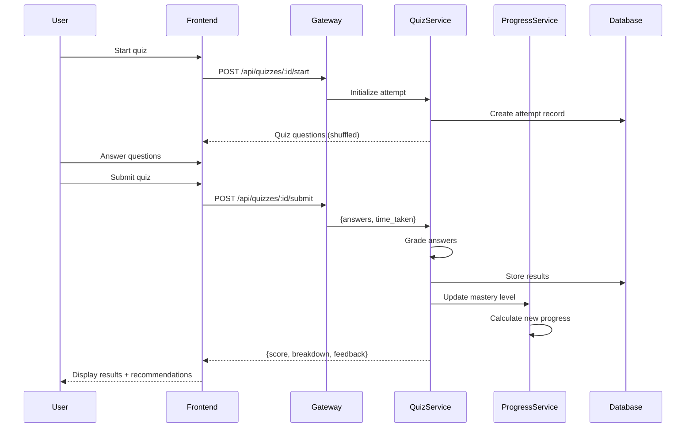
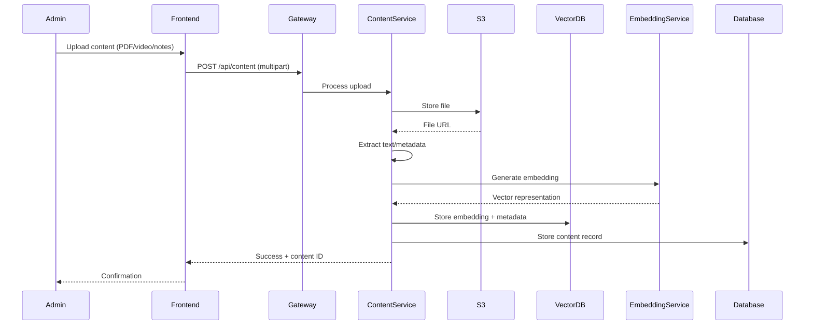

# Technical Architecture - Saarthi.ai

## System Overview

**Platform:** Saarthi.ai - AI Tutor Teaching Assistant (PoC)

A comprehensive AI-powered educational platform designed to help students master technical subjects through multi-modal content interaction, intelligent tutoring, code practice, and personalized learning paths.

---

## Architecture Diagram



---

## Tech Stack

### Frontend
- **Framework:** Next.js 14+ (React 18+)
- **Language:** TypeScript
- **Styling:** Tailwind CSS (with custom theme)
- **State Management:** Zustand / React Context
- **API Client:** Axios / React Query (for caching)
- **Code Editor:** Monaco Editor (VS Code engine)
- **Video Player:** Video.js / Plyr
- **Charts:** Recharts / Chart.js
- **Markdown Rendering:** React Markdown
- **Math Rendering:** KaTeX
- **Syntax Highlighting:** Prism.js / Highlight.js

### Backend
- **Framework:** Node.js with Express.js / Fastify
- **Language:** TypeScript
- **Authentication:** JWT + OAuth 2.0 (Google, GitHub)
- **API Style:** RESTful + WebSocket (for real-time chat)
- **Validation:** Zod / Joi
- **Documentation:** Swagger/OpenAPI

### Alternative Backend (Python-based AI services)
- **Framework:** FastAPI
- **Language:** Python 3.11+
- **AI Integration:** LangChain
- **Async:** asyncio

### Databases
- **Primary Database:** PostgreSQL (user data, relationships, transactions)
- **Document Store:** MongoDB (content, notes, quizzes, flexible schemas)
- **Vector Database:** Pinecone / Weaviate / ChromaDB (for RAG, semantic search)
- **Cache:** Redis (session management, API caching, real-time data)

### AI/ML Services
- **LLM:** Google Gemini / OpenAI GPT-4
- **Embeddings:** OpenAI text-embedding-ada-002 / Google PaLM Embeddings
- **RAG Framework:** LangChain / LlamaIndex
- **Code Execution:** Docker sandboxed containers (Judge0 API)
- **OCR (Handwritten Notes):** Google Cloud Vision API / Tesseract

### Infrastructure
- **Hosting:** Vercel (Frontend) / AWS/GCP (Backend)
- **Storage:** AWS S3 / Google Cloud Storage
- **CDN:** CloudFlare
- **Container Orchestration:** Docker + Kubernetes (for scaling)
- **CI/CD:** GitHub Actions
- **Monitoring:** Datadog / New Relic
- **Error Tracking:** Sentry

---

## Data Models

### User Schema (PostgreSQL)
```typescript
interface User {
  id: string (UUID);
  email: string (unique);
  password_hash: string;
  full_name: string;
  role: 'student' | 'admin';
  avatar_url?: string;
  created_at: timestamp;
  updated_at: timestamp;
  last_login: timestamp;
  preferences: {
    theme: 'light' | 'dark';
    notifications_enabled: boolean;
    language: string;
  };
}
```

### Content Schema (MongoDB)
```typescript
interface Content {
  _id: ObjectId;
  type: 'note' | 'video' | 'exercise' | 'assignment';
  title: string;
  subject: string; // 'DSP', 'ML', 'Algorithms'
  topic: string;
  subtopic?: string;
  description: string;
  content_url: string; // S3 link
  thumbnail_url?: string;
  source: {
    type: 'professor' | 'lab' | 'youtube';
    author: string;
    verified: boolean;
  };
  metadata: {
    file_size?: number;
    page_count?: number;
    duration?: number; // for videos
    language?: string;
  };
  tags: string[];
  difficulty: 'beginner' | 'intermediate' | 'advanced';
  created_at: Date;
  updated_at: Date;
  views: number;
  bookmarks: number;
}
```

### Quiz Schema (MongoDB)
```typescript
interface Quiz {
  _id: ObjectId;
  title: string;
  subject: string;
  topic: string;
  description: string;
  difficulty: 'easy' | 'medium' | 'hard';
  time_limit: number; // minutes
  questions: Question[];
  created_at: Date;
  created_by: string; // user_id
}

interface Question {
  id: string;
  type: 'multiple_choice' | 'true_false' | 'code' | 'short_answer';
  question_text: string;
  options?: string[]; // for MCQ
  correct_answer: string | string[];
  explanation: string;
  points: number;
  hint?: string;
}
```

### User Progress Schema (PostgreSQL)
```typescript
interface UserProgress {
  id: string (UUID);
  user_id: string (FK);
  subject: string;
  topic: string;
  mastery_level: number; // 0-100
  last_studied: timestamp;
  total_time_spent: number; // minutes
  quiz_scores: {
    quiz_id: string;
    score: number;
    attempts: number;
    last_attempt: timestamp;
  }[];
  videos_watched: {
    video_id: string;
    progress: number; // percentage
    completed: boolean;
    last_watched: timestamp;
  }[];
}
```

### Chat History Schema (MongoDB)
```typescript
interface ChatSession {
  _id: ObjectId;
  user_id: string;
  title: string; // auto-generated from first message
  messages: Message[];
  created_at: Date;
  updated_at: Date;
}

interface Message {
  id: string;
  role: 'user' | 'assistant';
  content: string;
  sources?: {
    type: 'note' | 'video' | 'web';
    reference: string;
    relevance_score: number;
  }[];
  feedback?: 'positive' | 'negative';
  timestamp: Date;
}
```

---

## API Design

### Authentication Endpoints
```
POST   /api/auth/signup          - Register new user
POST   /api/auth/signin          - Login user
POST   /api/auth/signout         - Logout user
POST   /api/auth/refresh         - Refresh JWT token
GET    /api/auth/me              - Get current user
POST   /api/auth/forgot-password - Request password reset
POST   /api/auth/reset-password  - Reset password
```

### User Endpoints
```
GET    /api/users/:id            - Get user profile
PUT    /api/users/:id            - Update user profile
GET    /api/users/:id/progress   - Get learning progress
GET    /api/users/:id/bookmarks  - Get bookmarked content
POST   /api/users/:id/bookmarks  - Add bookmark
DELETE /api/users/:id/bookmarks/:contentId - Remove bookmark
```

### Content Endpoints
```
GET    /api/content              - List all content (with filters)
GET    /api/content/:id          - Get specific content
GET    /api/content/search       - Search content
GET    /api/content/recommend    - Get recommended content
POST   /api/content              - Upload new content (admin)
PUT    /api/content/:id          - Update content (admin)
DELETE /api/content/:id          - Delete content (admin)
POST   /api/content/:id/view     - Track view
```

### AI/Chat Endpoints
```
POST   /api/chat/message         - Send message to AI
GET    /api/chat/sessions        - Get user's chat sessions
GET    /api/chat/sessions/:id    - Get specific chat session
POST   /api/chat/sessions        - Create new chat session
DELETE /api/chat/sessions/:id    - Delete chat session
POST   /api/chat/feedback        - Submit feedback on AI response
```

### Code Execution Endpoints
```
POST   /api/code/execute         - Execute code
GET    /api/code/languages       - Get supported languages
POST   /api/code/save            - Save code snippet
GET    /api/code/history         - Get user's code history
```

### Quiz Endpoints
```
GET    /api/quizzes              - List available quizzes
GET    /api/quizzes/:id          - Get quiz details
POST   /api/quizzes/:id/start    - Start quiz attempt
POST   /api/quizzes/:id/submit   - Submit quiz answers
GET    /api/quizzes/:id/results  - Get quiz results
GET    /api/quizzes/history      - Get user's quiz history
```

### Video Endpoints
```
GET    /api/videos               - List videos
GET    /api/videos/:id           - Get video details
POST   /api/videos/:id/progress  - Update watch progress
GET    /api/videos/:id/annotations - Get timestamped annotations
```

### Progress/Analytics Endpoints
```
GET    /api/progress/overview    - Get overall progress
GET    /api/progress/subject/:subject - Subject-wise progress
GET    /api/progress/streak      - Get study streak data
GET    /api/progress/weak-areas  - Get weak areas & recommendations
POST   /api/progress/goal        - Set learning goal
GET    /api/progress/goals       - Get active goals
```

---

## Workflow Architecture

### 1. User Authentication Flow



### 2. AI Chat Query Flow (with RAG)



### 3. Code Execution Flow



### 4. Video Learning Flow



### 5. Quiz Taking Flow



### 6. Content Ingestion Flow (Admin)



---

## Frontend-Backend Integration Plan

### State Management Strategy

**Global State (Zustand):**
- User authentication state
- Theme preferences
- Sidebar collapse state
- Active chat session

**Server State (React Query):**
- Content lists (with caching)
- User progress data
- Quiz data
- Video metadata

**Local State (React useState):**
- Form inputs
- Modal visibility
- Temporary UI states

### API Integration Patterns

```typescript
// services/api.ts
import axios from 'axios';

const api = axios.create({
  baseURL: process.env.NEXT_PUBLIC_API_URL,
  timeout: 10000,
  withCredentials: true, // for httpOnly cookies
});

// Request interceptor - add auth token
api.interceptors.request.use((config) => {
  const token = localStorage.getItem('access_token');
  if (token) {
    config.headers.Authorization = `Bearer ${token}`;
  }
  return config;
});

// Response interceptor - handle token refresh
api.interceptors.response.use(
  (response) => response,
  async (error) => {
    if (error.response?.status === 401) {
      // Try to refresh token
      try {
        const { data } = await axios.post('/api/auth/refresh');
        localStorage.setItem('access_token', data.access_token);
        // Retry original request
        return api(error.config);
      } catch {
        // Refresh failed, redirect to login
        window.location.href = '/login';
      }
    }
    return Promise.reject(error);
  }
);

export default api;
```

### Real-time Communication (WebSocket)

```typescript
// services/websocket.ts
import { io, Socket } from 'socket.io-client';

class WebSocketService {
  private socket: Socket | null = null;

  connect(userId: string) {
    this.socket = io(process.env.NEXT_PUBLIC_WS_URL!, {
      auth: { token: localStorage.getItem('access_token') },
      query: { userId },
    });

    this.socket.on('connect', () => {
      console.log('WebSocket connected');
    });

    this.socket.on('ai_response_chunk', (data) => {
      // Handle streaming AI responses
      this.onAIChunk(data);
    });
  }

  sendMessage(message: string) {
    this.socket?.emit('chat_message', { message });
  }

  onAIChunk(callback: (chunk: string) => void) {
    this.socket?.on('ai_response_chunk', callback);
  }

  disconnect() {
    this.socket?.disconnect();
  }
}

export default new WebSocketService();
```

### File Upload Handling

```typescript
// utils/upload.ts
export async function uploadFile(
  file: File,
  type: 'note' | 'assignment' | 'image'
): Promise<string> {
  const formData = new FormData();
  formData.append('file', file);
  formData.append('type', type);

  const { data } = await api.post('/api/upload', formData, {
    headers: { 'Content-Type': 'multipart/form-data' },
    onUploadProgress: (progressEvent) => {
      const progress = (progressEvent.loaded / progressEvent.total!) * 100;
      console.log(`Upload progress: ${progress}%`);
    },
  });

  return data.url;
}
```

---

## Backend API Implementation Strategy

### Project Structure

```
backend/
├── src/
│   ├── config/           # Configuration files
│   │   ├── database.ts
│   │   ├── redis.ts
│   │   └── env.ts
│   ├── middleware/       # Express middleware
│   │   ├── auth.ts
│   │   ├── validation.ts
│   │   ├── rateLimit.ts
│   │   └── errorHandler.ts
│   ├── routes/           # API routes
│   │   ├── auth.routes.ts
│   │   ├── user.routes.ts
│   │   ├── content.routes.ts
│   │   ├── chat.routes.ts
│   │   ├── code.routes.ts
│   │   ├── quiz.routes.ts
│   │   └── progress.routes.ts
│   ├── controllers/      # Route handlers
│   │   ├── auth.controller.ts
│   │   ├── user.controller.ts
│   │   └── ...
│   ├── services/         # Business logic
│   │   ├── ai.service.ts
│   │   ├── rag.service.ts
│   │   ├── code.service.ts
│   │   ├── email.service.ts
│   │   └── ...
│   ├── models/           # Database models
│   │   ├── user.model.ts
│   │   ├── content.model.ts
│   │   └── ...
│   ├── utils/            # Utilities
│   │   ├── jwt.ts
│   │   ├── bcrypt.ts
│   │   └── validators.ts
│   └── app.ts            # Express app setup
├── tests/                # Test files
├── package.json
└── tsconfig.json
```

### Authentication Middleware

```typescript
// middleware/auth.ts
import { Request, Response, NextFunction } from 'express';
import jwt from 'jsonwebtoken';

export interface AuthRequest extends Request {
  user?: {
    id: string;
    email: string;
    role: string;
  };
}

export const authenticate = (
  req: AuthRequest,
  res: Response,
  next: NextFunction
) => {
  try {
    const token = req.headers.authorization?.split(' ')[1];
    
    if (!token) {
      return res.status(401).json({ error: 'Authentication required' });
    }

    const decoded = jwt.verify(token, process.env.JWT_SECRET!) as any;
    req.user = decoded;
    next();
  } catch (error) {
    return res.status(401).json({ error: 'Invalid or expired token' });
  }
};

export const authorize = (...roles: string[]) => {
  return (req: AuthRequest, res: Response, next: NextFunction) => {
    if (!req.user || !roles.includes(req.user.role)) {
      return res.status(403).json({ error: 'Insufficient permissions' });
    }
    next();
  };
};
```

### RAG Service Implementation

```typescript
// services/rag.service.ts
import { OpenAIEmbeddings } from '@langchain/openai';
import { PineconeStore } from '@langchain/pinecone';
import { Pinecone } from '@pinecone-database/pinecone';

class RAGService {
  private embeddings: OpenAIEmbeddings;
  private vectorStore: PineconeStore;

  constructor() {
    this.embeddings = new OpenAIEmbeddings({
      modelName: 'text-embedding-ada-002',
    });

    const pinecone = new Pinecone({
      apiKey: process.env.PINECONE_API_KEY!,
    });

    this.vectorStore = PineconeStore.fromExistingIndex(this.embeddings, {
      pineconeIndex: pinecone.Index(process.env.PINECONE_INDEX!),
    });
  }

  async searchRelevantContent(
    query: string,
    filters?: { subject?: string; topic?: string }
  ) {
    const results = await this.vectorStore.similaritySearchWithScore(
      query,
      5, // top 5 results
      filters
    );

    return results.map(([doc, score]) => ({
      content: doc.pageContent,
      metadata: doc.metadata,
      relevanceScore: score,
    }));
  }

  async addContent(
    content: string,
    metadata: { subject: string; topic: string; type: string; id: string }
  ) {
    await this.vectorStore.addDocuments([
      {
        pageContent: content,
        metadata,
      },
    ]);
  }
}

export default new RAGService();
```

### AI Chat Service

```typescript
// services/ai.service.ts
import { ChatOpenAI } from '@langchain/openai';
import { ChatPromptTemplate } from '@langchain/core/prompts';
import ragService from './rag.service';

class AIService {
  private llm: ChatOpenAI;

  constructor() {
    this.llm = new ChatOpenAI({
      modelName: 'gpt-4',
      temperature: 0.7,
      streaming: true,
    });
  }

  async generateResponse(
    question: string,
    userId: string,
    subject?: string
  ): Promise<{
    response: string;
    sources: any[];
  }> {
    // 1. Get relevant context using RAG
    const relevantDocs = await ragService.searchRelevantContent(question, {
      subject,
    });

    // 2. Build prompt with context
    const context = relevantDocs
      .map((doc) => doc.content)
      .join('\n\n');

    const promptTemplate = ChatPromptTemplate.fromMessages([
      [
        'system',
        `You are an intelligent tutor helping students learn technical subjects.
        Use the following context from course materials to answer the question accurately.
        
        Context:
        {context}
        
        Guidelines:
        - Explain concepts clearly and concisely
        - Use examples when helpful
        - Cite sources when using specific information from context
        - If the context doesn't contain the answer, say so and provide general guidance
        - Be encouraging and supportive`,
      ],
      ['user', '{question}'],
    ]);

    const chain = promptTemplate.pipe(this.llm);
    
    // 3. Generate response
    const response = await chain.invoke({
      context,
      question,
    });

    return {
      response: response.content as string,
      sources: relevantDocs.map((doc) => ({
        type: doc.metadata.type,
        reference: doc.metadata.id,
        relevanceScore: doc.relevanceScore,
      })),
    };
  }

  async streamResponse(
    question: string,
    onChunk: (chunk: string) => void
  ): Promise<void> {
    const relevantDocs = await ragService.searchRelevantContent(question);
    const context = relevantDocs.map((doc) => doc.content).join('\n\n');

    const stream = await this.llm.stream([
      {
        role: 'system',
        content: `You are a helpful tutor. Context: ${context}`,
      },
      { role: 'user', content: question },
    ]);

    for await (const chunk of stream) {
      onChunk(chunk.content as string);
    }
  }
}

export default new AIService();
```

---

## Security Considerations

### 1. Authentication Security
- JWT with short expiration (15 minutes)
- Refresh tokens stored in httpOnly cookies
- Password hashing with bcrypt (cost factor 12)
- Rate limiting on auth endpoints (5 attempts per 15 min)

### 2. API Security
- CORS configuration (whitelist frontend domains)
- Input validation on all endpoints (Zod)
- SQL injection prevention (parameterized queries)
- NoSQL injection prevention (sanitization)
- File upload restrictions (type, size validation)

### 3. Code Execution Security
- Sandboxed Docker containers
- Resource limits (CPU, memory, execution time)
- Network isolation (no external access)
- Language-specific restrictions

### 4. Data Security
- Encryption at rest (database encryption)
- Encryption in transit (HTTPS/TLS 1.3)
- PII data encryption
- Secure S3 bucket policies (private by default)

---

## Performance Optimization

### 1. Caching Strategy
- **Redis Cache:**
  - API responses (TTL: 5 minutes)
  - User sessions
  - Frequently accessed content metadata
  
### 2. Database Optimization
- Proper indexing on frequently queried fields
- Connection pooling
- Read replicas for scaling
- Pagination for large datasets

### 3. Frontend Optimization
- Code splitting (route-based)
- Image optimization (Next.js Image)
- Lazy loading components
- Service Worker for offline support
- CDN for static assets

### 4. API Optimization
- Response compression (gzip/brotli)
- Request batching
- GraphQL for complex queries (optional)
- WebSocket for real-time features

---

## Deployment Strategy

### Development Environment
```yaml
Frontend: localhost:3000
Backend: localhost:8000
PostgreSQL: localhost:5432
MongoDB: localhost:27017
Redis: localhost:6379
```

### Staging Environment
```yaml
Frontend: staging.yourapp.com (Vercel)
Backend: api-staging.yourapp.com (AWS ECS)
Databases: AWS RDS + DocumentDB
Redis: AWS ElastiCache
```

### Production Environment
```yaml
Frontend: app.yourapp.com (Vercel + CloudFlare CDN)
Backend: api.yourapp.com (AWS ECS + Load Balancer)
Databases: AWS RDS (Multi-AZ) + DocumentDB
Redis: AWS ElastiCache (Cluster mode)
Monitoring: Datadog + Sentry
```

### CI/CD Pipeline
1. **Commit to GitHub**
2. **Run Tests** (Unit + Integration)
3. **Build Docker Images**
4. **Push to Container Registry**
5. **Deploy to Staging** (automatic)
6. **Run E2E Tests**
7. **Deploy to Production** (manual approval)
8. **Post-deployment Health Checks**

---

## Monitoring & Analytics

### Application Metrics
- API response times
- Error rates by endpoint
- Database query performance
- Cache hit rates
- AI response latency

### User Analytics
- Active users (DAU/MAU)
- Feature usage
- Learning paths
- Quiz completion rates
- Video engagement
- Chat interactions

### Business Metrics
- User retention
- Content consumption
- Learning outcomes (mastery levels)
- User satisfaction (feedback scores)

---

## Scalability Plan

### Horizontal Scaling
- Load balancer distributing traffic
- Stateless backend services (multiple instances)
- Database read replicas
- Redis cluster for distributed caching

### Vertical Scaling
- Upgrade instance types as needed
- Optimize database queries
- Code optimization

### Auto-scaling Triggers
- CPU utilization > 70%
- Memory utilization > 80%
- Request queue depth > 100

---

## Future Enhancements

1. **Mobile Apps** (React Native)
2. **Offline Mode** (Progressive Web App)
3. **Collaborative Features** (Study groups, peer discussions)
4. **Gamification** (Badges, leaderboards, achievements)
5. **Voice Interface** (Voice queries to AI)
6. **Advanced Analytics** (Learning pattern analysis)
7. **Personalized Learning Paths** (ML-based recommendations)
8. **Integration with LMS** (Canvas, Moodle)
9. **Multi-language Support** (i18n)
10. **Accessibility Improvements** (Screen reader optimization)

---

This architecture provides a solid foundation for building a scalable, performant, and user-friendly educational AI platform! 🚀
